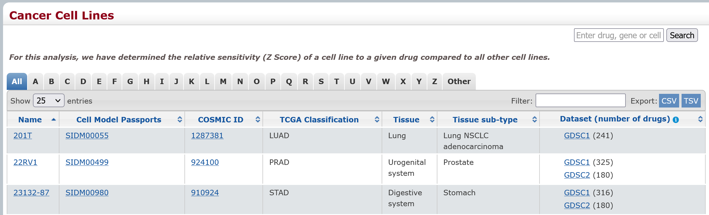

```{r, include=F}
library(tidyverse)
library(magrittr)
# library(disk.frame)
library(ggplot2)
library(here)
library(kableExtra)
library(knitr)
library(openxlsx)
library(vroom)
```


```{r, include=F}
printDF = function(df)
{
  df %>% 
  kable() %>% 
  kable_styling(
    bootstrap_options = c(
      "condensed",
      full_width = F,
      font_size = 8
    )
  ) %>% 
  kable_paper() %>% 
  scroll_box(width = "100%", height = "200px")
}

registerS3method("knit_print", "data.frame", printDF)
```


```{r, include=F}
knitr::opts_chunk$set(
  comment = '',
  fig.width = 6, 
  fig.height = 6,
  root.dir = here("GDSC")
)

eval_r = TRUE
eval_sh = FALSE
```

# Introduction
This notebook downloads data from the GDSC website and FTP site and takes a `glimpse` at it. In a separate notebook I normalize and harmonize the data and upload to BigQuery. By this I mean insuring that the data is in the right format, uploaded with the right schema, that the column names are both correct and in a unified format. For example, the field name for a drug is "drug_name" in all tables as opposed "name" or "compound."

# File Categories
There are two categories of files:

## Metadata Files (lookup tables)
There are two metadata files that are strictly metadata and do not contain results.

- Cell Line Metadata: Properties and identifiers of cell lines such as a unique identifier, cell type, disease, references to other databases, etc.

- Drug (compound) Metadata: Properties and identifiers of drugs such as a unique identifier, drug bank id, drug synonyms, drug target, references to other databases.

A third metadata field describes the properties genetic features determined through the learning algorithms GDSC used. Although it is technically a result, it also serves as a metadata file. There are a small number of genetic features which is smaller than the number of cell lines. Each cell lines contain a list of these genetic features. 

## Results
There are three results files
- IC50 calculates
- ANOVA resuults
- Genetic Feartures (see above)

# Accessing the files
## Metadata Download Pages
There are a few different ways to download files. There are three pages in the menu bar: 
- Compounds---drug data
- Features---The genetic features found to mediate the drug response
- Cell Lines---The cell lines used in the study

These pages provide a data preview and also have buttons to download TSV and CSV versions of the files.

## Downloads Page
There is also a _Downloads_ page with multiple download options. This page has a form with four tabs: 

- ANOVA Results
- Drug Data
- Genetic Features
- Bulk Data Download.

The tabs for ANOVA Results and Drug Data show a table called "Preview: drugs included in download." This is metadata for the drugs studied. The preview tble has buttons to download CSV, TSV, and XLX. Only 25 rows are initially displayed, however, you can select all rows. The table you get is always (cryptically) called "export.(tsv|csv|xlsx)".

The main form has a download button and you can select certain parameters from a dropdown menu (such as GDSC version). The form always downloads CSV files with a timestamp in their name.

## Bulk Download
The Bulk Data Download tab has links for downloading most of the data files as well as a heading _Archive_ with a link "Click here to download all releases." This is an FTP address. Browsers no long handle FTP, so you need to copy the link and use an FTP client. ALL of the links on the Bulk Data Download tab are FTP links. 

## Archive (current release)
Here is a listing of the files in the archive.

### WGET the Releases Index
```{bash,  engine.opts='-l'}
mkdir -p large_files

wget -O large_files/releases.html ftp://ftp.sanger.ac.uk/pub/project/cancerrxgene/releases/

cat large_files/releases.html | sed -E $'/^<pre>$/,/^<\/pre>$/!d;/^<pre>$/d;/^<\/pre>$/d; s/^\s+//g; s/\s{2,}/\t/g; s/<[^<>]+>//g'
```

### WGET Current Release
```{bash,  engine.opts='-l'}
wget -O large_files/current_release.html ftp://ftp.sanger.ac.uk/pub/project/cancerrxgene/releases/current_release/

cat large_files/current_release.html | sed -E $'/^<pre>$/,/^<\/pre>$/!d;/^<pre>$/d;/^<\/pre>$/d; s/^\s+//g; s/\s{2,}/\t/g; s/<[^<>]+>//g'
```


# Download GDSC Current Release from FTP

I eventually decided that the simplest way to download most of the data is through the FTP directory. However, how have to use the XLSX files because the CSV files are useless. As shown below, array elements are sepparated by commas as well as the fields.

However, not all of the metadata files are in the release. One also needs to be downloaded through the website. Also, the ones you download from the website and the ones in the release have some different fields. So they really need to be merged.


```{bash,  engine.opts='-l', eval=eval_sh}
pwd

mkdir -p large_files

### --no-directories....just filenames, not directory structure in url
### --directory-prefix....save to directory

wget \
  --quiet \
  --recursive \
  --no-directories \
  --directory-prefix=large_files \
  --backups 0 \
  ftp://ftp.sanger.ac.uk/pub/project/cancerrxgene/releases/release-8.2/
  
ls -larSh large_files
  
```

```{bash, engine.opts='-l'}
pwd
```


## Problems with CSV files
Notice that the number of fields is not consistent.

HOWEVER, there is one CSV file that can be processed normally because each value is quoted, so that arrays are comma separated within quotes. Excel will read these in properly. R even seems to figure it out with base `read.csv`.
```{bash,  engine.opts='-l', eval=eval_sh}
find large_files -name "*.csv" | \
while read -r file; do
  echo "File: $file"
  echo "Number of fields: `awk -v FS="," 'NR==1{print NF}' $file`"
  
  echo "Fields in Header:"
  head -n1 $file | tr "," "\n"
  
  echo "Counts of numbers of fields in rows:"
  awk -v FS="," '{print NF}' $file \
  | sort \
  | uniq -c
  
  echo "-------------------------------------------------\n\n"
done
```


## The XLSX Files
```{bash,  engine.opts='-l'}
ls large_files/*.xlsx
```

The raw data is what is used to create the IC50 tables and ANOVA results. It may be interesting to some people, but not most. But it might as well be included.

I don't know how "out of date" the GDSC1 vs. GDSC2 data is. Perhaps good to include both?


## Cell Metadata
### Overview
The _Cell_Lines_Details.xlsx_ file has three sheets. The third sheet, _Decode_, has three metadata tables on one sheet. These must be extracted by specifying rows and columns.

```{r}
wb = loadWorkbook("large_files/Cell_Lines_Details.xlsx")

sheets = names(wb)
print(sheets)
```

### Cell Line Details
**Note:** For later use, I will save a file of the cell line details.
```{r}
print("--- Cell Line Details ---")
cell_line_details = readWorkbook(
  wb,
  sheet="Cell line details"
)
glimpse(cell_line_details)

vroom_write(
  cell_line_details, 
  "large_files/cell_line_details_only.tsv"
  )
```

### COSMIC tissue classification
This refers to the COSMIC project
```{r}
print("--- COSMIC Tissue Classificaiton ---")
cell_line_details = readWorkbook(
  wb,
  sheet="COSMIC tissue classification"
)
glimpse(cell_line_details)
```


### Decode
This worksheet has three tables just kind of on the sheet. So you have to specify columns and rows to load them.

It would be worthwhile to cross-check that the definitions are those provided by the organization the data is from, or something written by the GDSC folks.

**Note:** For later use, I will save a file of the TCGA cancer types.
```{r}
print("--- TCGA Cancer Types ---")
tcga_cancer_types = readWorkbook(
  wb, 
  sheet="Decode", 
  rows=2:32, 
  cols=1:2
)
colnames(tcga_cancer_types) = c("tcga_cancer_type", "description")
glimpse(tcga_cancer_types)

vroom_write(tcga_cancer_types, "large_files/tcga_cancer_types.tsv")
cat("\n")

print("--- Microsatellite Instability Data ---")
microsatellite_class = readWorkbook(
  wb, 
  sheet="Decode", 
  rows=38:40, 
  cols=1:2, 
  rowNames = F, 
  colNames = F
)
colnames(microsatellite_class) = c("name", "description")
glimpse(microsatellite_class)
cat("\n")


print("--- Growth Media ---")
growth_media = readWorkbook(
  wb,
  sheet="Decode",
  rows=47:51,
  cols=1:2,
  rowNames = F,
  colNames = F
)
colnames(growth_media) = c("name", "description")
glimpse(growth_media)

gc()
```


## Drug Metadata
```{r}
drug_metadata = read.csv("large_files/screened_compunds_rel_8.2.csv")

glimpse(drug_metadata)
```


## IC50 Results 
```{r}
wb = loadWorkbook("large_files/GDSC2_fitted_dose_response_25Feb20.xlsx")

sheets = names(wb)
print(sheets)

IC50_results = read.xlsx(
  "large_files/GDSC2_fitted_dose_response_25Feb20.xlsx", 
  sheet=sheets[1]
)

glimpse(IC50_results)

gc()
```

## ANOVA Results
GDSC did a PANCANCER analysis where they looked for features across all cancer types. They also did individual analyses for each or ### cancer types defined in the TCGA project.

Will need to check that all of the tables have the same format.
```{r}
wb = loadWorkbook("large_files/ANOVA_results_GDSC2_20Feb20.xlsx")
sheets = names(wb)
print(sheets)

num_rows = list()
for (sheet in sheets)
{
  data = read.xlsx(
    "large_files/ANOVA_results_GDSC2_20Feb20.xlsx",
    sheet = sheet
  )
  num_rows[sheet] = nrow(data)
  
  gc()
}

print(num_rows)

anova_results = read.xlsx(
  "large_files/ANOVA_results_GDSC2_20Feb20.xlsx",
  sheet = sheets[1]
)

glimpse(anova_results)

gc()
```


## Raw Data
```{r}
gdsc_raw = vroom("large_files/GDSC2_public_raw_data_25Feb20.csv")

spec(gdsc_raw)

glimpse(gdsc_raw)

gc()
```


# Data from Website
Even though the genetic features seems like one of the most important GDSC results, they are not included in the FTP files. The cell_lines and screened_compounds tables are vailable on the website as well as through FTP. The genetic features table is only available online.

What's interesting about accessing the data this way is that you usually get more rows. The file names are stamped with the current date. Maybe they are more up-to-date than the "current release" and have more data? Also, the columns in the previews are not consistent with what you get in the downloaded files. In some cases, they are flat out wrong and need to be changed.

Drug metadata can be downloaded from the _Compounds_ page in the menu bar. The page displays a preview of the data. There is a button for both TSV and CSV download. Using the button downloads either a TSV or CSV file. However if you copy the button link URL, you get TSV either way. Fortunately, they have changed the format so all data elements are quoted, which makes array elements ok in the CSV because the arrays are comma-delimited. 

However, the field names have spaces in the words which messes up reading the files. One stragegy is to edit the header (which you can do with `sed` or whatever) or skip the header and set the colnames. Alternatively, you can edit the header in R as the field names end up in quotes.

There are a few ways to generate a URL to download the data. What seems to work best for me is to right click on the button (TSV or CSV) and select open in new tab. Close the Save File UI box. Open developer tools. Reload the page. Copy the GET header under network.

## Compounds
This should be roughly the same data as in the "screened_compunds_rel_8.2.csv" file from the current release FTP.


```{bash,  engine.opts='-l', include=F}
rm large_files/drug_list.tsv

curl -o large_files/drug_list.tsv -s https://www.cancerrxgene.org/api/compounds?export=tsv &> err
```


```{bash,  engine.opts='-l'}
wc large_files/drug_list.tsv

head large_files/drug_list.tsv

head -n1 large_files/drug_list.tsv | tr "\t" "\n"
awk -v FS="\t" 'NR==2{print NF}' large_files/drug_list.tsv
```


## Cell Lines
```{bash,  engine.opts='-l'}
rm large_files/cell_lines.csv

#curl -o large_files/cell_lines.tsv -s https://www.cancerrxgene.org/api/celllines?export=tsv &> err

curl -o large_files/cell_lines.csv -s https://www.cancerrxgene.org/api/celllines?export=csv &> err
```

```{bash,  engine.opts='-l'}
wc large_files/cell_lines.csv
head large_files/cell_lines.csv

head -n1 large_files/cell_lines.tsv | tr "," "\n"

awk -v FS="," 'NR==2{print NF}' large_files/cell_lines.csv
```

Here is where we get to have a lot of fun. Notice the order of the six (6) columns in the tsv export: "COSMIC_ID", "Name" "COSMIC_ID", "Tissue", "Tissue sub-type", "Count". Compare these to the columns in the preview. Also, the actual number of fields is 10. The "Cell Passports Model" is now the first column, but is called "COSMIC_ID." The Cell Passports Model id is repeated as the fourth column after COSMIC_id.
 


The cell lines data export has roughly the same data as in the "Cell_Lines_Details.xlsx" file from the current release FTP.


## Genetic Features Results
Download Results from _Downloads_ page form:

Again, there seems to be two places to download the cell features. One is the _Features_ page. The other is through the _Downloads_ page form. The files from the _Features_ page appear to be a kind of metadata about the features that is not specific to any cell line. The files form the _Downloads_ page seem to be the features discovered for each cell line through the machine learning. Thus, we would expect the number of rows in these files to be approximately the number of cell lines times the number of features.

For PANCANCER, the features metadata file (from the _Features_ page, _genetic_features_PANCANCER.tsv_) lists 693 unique features.

### Pancancer
```{bash,  engine.opts='-l'}
### Handle PANCANCER --- biggest file
tissue="PANCANCER"
cmd="wget \
  --quiet \
  --output-document="large_files/genetic_features_${tissue}_results.csv" \
  https://www.cancerrxgene.org/downloads/download/genetic_feature?tissue=${tissue}&mutation=both&screening_set=GDSC2"
echo "$cmd"
$cmd

awk -v FS="," '{print NF}' large_files/genetic_features_${tissue}_results.csv | sort | uniq -c

### Convert to TSV 
awk \
  '{cols=1; while (cols < 9) {sub("," , "\t"); cols++} print }' \
  large_files/genetic_features_${tissue}_results.csv \
  > large_files/genetic_features_${tissue}_results.tsv

### Delete CSV
rm large_files/genetic_features_${tissue}_results.csv
```

The cell lines metadata file (from the _Cell Lines_ page) lists 988 cell lines.

```{bash,  engine.opts='-l'}
### cell line name is 2nd column
tail -n +2 large_files/cell_lines.tsv | 
cut -f2 |
sort | 
uniq | 
wc
```

The product is 693 &times; 988 = 684,684 combineations.

The PANCANCER data file (cell lines and genetic features) has 583,305 records, so somewhat less. It's reasonable that some cell lines simply did not have all genetic features.

So, hopefully my assumptions about these files are correct.


It was hard to figure out how to capture the URL to GET the features for each cancer type. I was able to determine it by inspecting the download button which has a property called `data-base-url` with the value `/downloads/download/genetic_feature`. Also, after making choices from the dropdowns (e.g. Screening Set, Select Tissue Type, Select Mutation Type), the page URL would look like `https://www.cancerrxgene.org/downloads/genetic_features?tissue=ALL&mutation=both&screening_set=GDSC1`.  The trick was to combine the two ideas and remove the "s" from "genetic_features." For instnce:

`https://www.cancerrxgene.org/downloads/download/genetic_feature?tissue=ALL&mutation=both&screening_set=GDSC1`

These files are a complete trainwreck because they are CSV files with an array column (Genes in Segment) that is comma-delimited. Luckily, this column is the last of the 10 columns. So by replacing the commas with tabs (using `awk`), I convert the file to tab-delimited with a comma-delimited array column as the last column.


### All TCGA
```{bash,  engine.opts='-l'}

### Loop through TCGA cancer types in file and download using
### that tissue type
cat large_files/tcga_cancer_types.tsv |
tail -n +2 |
cut -f1 |
while read -r tissue; do
  echo $tissue
  cmd="wget \
      --quiet \
      --output-document="large_files/genetic_features_${tissue}_results.csv" \
      https://www.cancerrxgene.org/downloads/download/genetic_feature?tissue=${tissue}&mutation=both&screening_set=GDSC2"
  echo "$cmd"
  $cmd
  
  ### Show ragged fields
  awk -v FS="," '{print NF}' large_files/genetic_features_${tissue}_results.csv | sort | uniq -c
  
  ### Convert to TSV
  awk \
    '{cols=1; while (cols < 9) {sub("," , "\t"); cols++} print }' \
    large_files/genetic_features_${tissue}_results.csv \
    > large_files/genetic_features_${tissue}_results.tsv

  ### Delete CSV
  rm large_files/genetic_features_${tissue}_results.csv
done
```


### Combine Individual Tissue Types

Because the total records for individual tissues is much less than for PANCANCER, IMO it makes sense to combine these into a single file and add a column for _tcga_cancer_type_. This is pretty easy using awk. I'll do it for both sets of features files---downloads page and Features page.

```{bash,  engine.opts='-l'}
### Get columns
cols=`head -n1 large_files/genetic_features_PANCANCER_results.tsv`

### Add tcga_cancer_type column
cols="tcga_cancer_type\t$cols\n"
printf "$cols"

### Start file with cols
printf "$cols" > large_files/genetic_features_all_tcga_results.tsv

### Loop through tcga cancer types, add column, append to file
### Make sure to skip header row
cat large_files/tcga_cancer_types.tsv |
tail -n +2 |
cut -f1 |
while read -r tissue; do
  echo $tissue
  awk \
    -v IFS="\t" \
    -v OFS="\t" \
    -v tcga="$tissue" \
    'NR>1{print "\"" tcga "\"",$0}' \
    large_files/genetic_features_${tissue}_results.tsv \
    >> large_files/genetic_features_all_tcga_results.tsv
done
```

### Delete Intermediate Files
```{bash,  engine.opts='-l'}

### Delete intermediate files
cat large_files/tcga_cancer_types.tsv |
tail -n +2 |
cut -f1 |
while read -r tissue; do
  echo $tissue
  rm large_files/genetic_features_${tissue}_results.tsv
done
```

## Genetic Features Metadata
### Pancancer

```{bash,  engine.opts='-l'}
tissue="PANCANCER"
cmd="wget \
      --quiet \
      --output-document="large_files/genetic_features_${tissue}_metadata.tsv" \
      https://www.cancerrxgene.org/api/features?tissue=${tissue}&export=tsv"
echo $cmd
$cmd

awk -v FS="\t" '{print NF}' large_files/genetic_features_${tissue}_metadata.tsv | sort | uniq -c
```

### Download All TCGA Cancer Types
```{bash,  engine.opts='-l'}
cat large_files/tcga_cancer_types.tsv |
tail -n +2 |
cut -f1 |
while read -r tissue; do
  echo $type
  cmd="wget \
      --quiet \
      --output-document="large_files/genetic_features_${tissue}_metadata.tsv" \
      https://www.cancerrxgene.org/api/features?tissue=${tissue}&export=tsv"
  echo $cmd
  $cmd
  
  awk -v FS="\t" '{print NF}' large_files/genetic_features_${tissue}_metadata.tsv | sort | uniq -c

done
```


### Combine TCGA Cancer Types
Eliminate "Count" column---last column #5.
```{bash,  engine.opts='-l'}
### Get columns from PANCANCER
cols=`head -n1 large_files/genetic_features_PANCANCER_metadata.tsv`

echo $cols

### Add tcga_cancer_type column
cols="tcga_cancer_type\t$cols"

### Start file with cols
printf "$cols\n" > large_files/genetic_features_all_tcga_metadata.tsv

### Loop through tcga cancer types, add column, append to file
### Make sure to skip header row
cat large_files/tcga_cancer_types.tsv |
tail -n +2 |
cut -f1 |
while read -r tissue; do
  echo $tissue
  awk \
    -v IFS="\t" \
    -v OFS="\t" \
    -v tcga="$tissue" \
    'NR>1{print "\"" tcga "\"",$0}' \
    large_files/genetic_features_${tissue}_metadata.tsv \
    >> large_files/genetic_features_all_tcga_metadata.tsv
done
```


### Delete Intermediate Files
```{bash,  engine.opts='-l'}

### Delete intermediate files
cat large_files/tcga_cancer_types.tsv |
tail -n +2 |
cut -f1 |
while read -r tissue; do
  echo $tissue
  rm large_files/genetic_features_${tissue}_metadata.tsv
done
```


# Conclusion
We have shown how to download all of the data files from the GDSC website. Some tables are located in multiple places (thee in the case of the drug data), but the format and number of records is not consistent. Some tables download in formats that cannot be read, and others with incomplete or incorrect headers. Also some tables with the _same_ data may not have all the same columns.

Therefore, we must have a clear strategy when downloading tables from GDSC for how to combine, normalize, and harmonize the data.


Save excel sheets to tsv files.

Systematize schema generation. Put in tsv file.
colname, description, type, mode

Where to get more descriptions?


