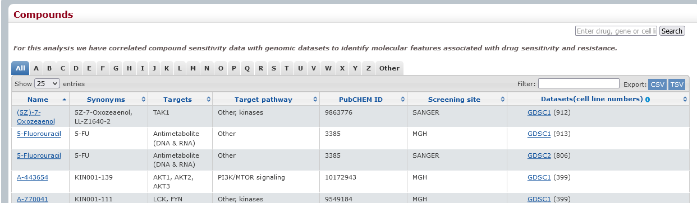
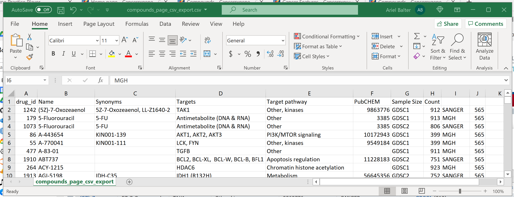
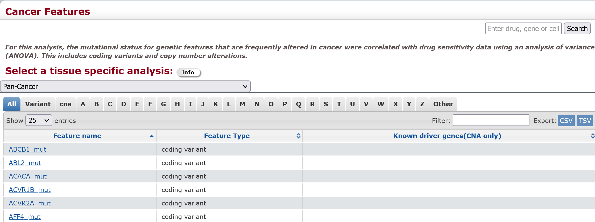
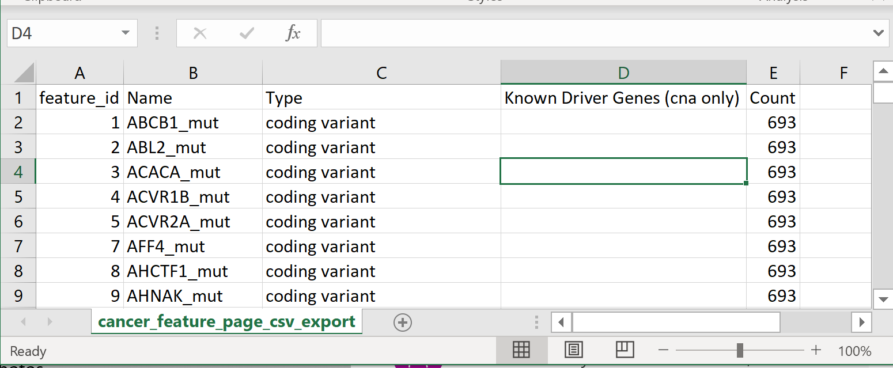
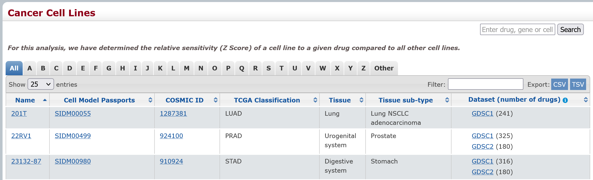
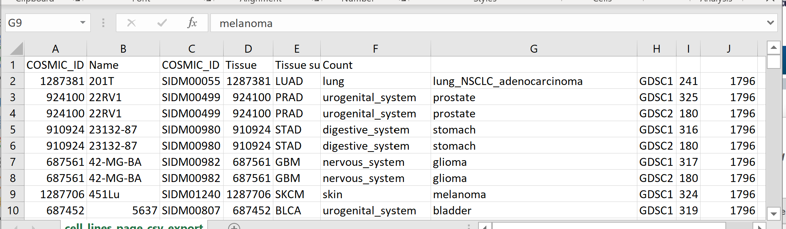
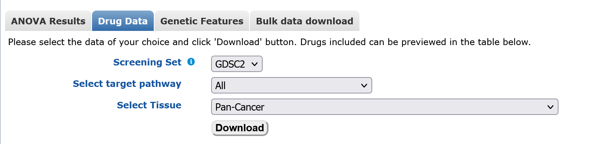
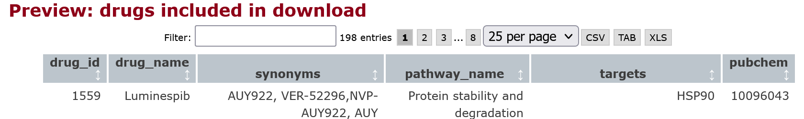

```{r, echo=F, include=F}
library(tidyverse)
library(magrittr)
library(ggplot2)
library(openxlsx)
library(knitr)
library(kableExtra)
```


# Introduction
The Genomics of Drug Sensitivity in Cancer project provides carefully curated and multifaceted statistical data on how well different drugs target different cancers in different cell lines. These data allow researches to study higher-order connections computationally, and also inform future in-vitro experiments. They are becoming invaluable for understanding cancer and developing treatments.

I am exploring this data to help build a graph database that will define genes, cell lines, cancers, and drugs as entities with other variables as connections between them. Doing this requires data tables that are clean, properly formatted, and well-harmonized. Computation work relies on data being presented in a uniform way so that the programmer does not need to handle a host of formatting edge-cases either by hand or with large amounts of code that have nothing to do with the actual analysis. Then programmers have to do those things, it becomes nearly impossible to do reproducible analysis and guarantee their results to be free of human error.

In preparing the GDSC data to enter into a relational database and then a graph database, I discovered numerous issues. Some of these are convenience issues, such as similar data having different column names in different files and data in Excel files containing multiple, heterogeneous sheets. Some of the issues exposed missing but essential information about data tables, such as when they were last updated, and how they relate to other apparently similar data tables. Unfortunately, I also found some catastrophic problems such as tables with mislabeled columns and missing column names.

I collected my observations in this notebook for three reasons.

- As a guide for myself to know how to process the GDSC tables
- As a guide for someone who joins this project or picks it up down the road
- As information for the GDSC project to help them identify data issues and perhaps improve their data quality, uniformity, harmonization, and access.

# Note on Reproducible Research
The world of computational science research has learned that a scientific study is incomplete if it includes the results of computational analysis but not the computer code that produced those results. Reproducible research means providing the computational tools to reproduce results as well as the results themselves.

The first step in any reproducible research project is cleaning and harmonizing data. This means cleaning data to make sure data are in exactly the same consistent format wherever they appear. For example, (Yes|No) should always be in that format, and not (y|n) or (1|0). Column names for matching variables should always be the same. Column names should be in a consistent format for importing into data analysis programs. This means no spaces or hyphens and periods should be avoided. Filenames should be as consistent as possible to facilitate automation and searching. Etc.

I'm hoping that in light of the information in this analysis the GDSC project will consider providing a way to access their data which tries to meet the needs of computational scientists as much as possible. Given the inconsistencies I found, it might be that the best solution would be to host the data in a relational database, and have back-end processes that provide the tables in Excel files such as are available now for those who prefer them in that format.

# Accessing GDSC Data
There are three places on the website to access data files. However, documentation is scarce regarding how these files are related. We looked at the different ways of accessing data and
tried to understand how they relate.

# Metadata Pages and Table Exports

The website has three dedicated pages for downloading metadata that describes the entities (genes, drugs, cells, etc.) referred to in the data containing the results: Compounds (drugs), Features, Cell Lines


- [_Compounds - Cancerrxgene - Genomics of Drug Sensitivity in Cancer_](https://www.cancerrxgene.org/compounds)

- [_Cancer Features - Cancerrxgene - Genomics of Drug Sensitivity in Cancer_](https://www.cancerrxgene.org/features)

- [_Cancer Cell Lines - Cancerrxgene - Genomics of Drug Sensitivity in Cancer_](https://www.cancerrxgene.org/celllines)


Each has a table preview and also export buttons for CSV and TSV. However, the way the exported data is put into columns is different than in the preview table and include a column (the last) of unknown significance. More importantly, the the columns in the exported data are incomplete and sometimes incorrect.

## Compounds (i.e. Drugs)
### Table Preview
**Records:**  518  
**Columns:**  `Name`, `Synonyms`, `Targets`, `Target pathway`, `PubCHEM ID`, `Screening site`, `Datasets (cell line numbers)`  



### CSV export
**Records:** 565  
**Columns:** `drug_id`, `Name`, `Synonyms`, `Targets`, `Target pathway`, `PubCHEM`, `Sample Size`, `Count`

The exported CSV is called `Drug_list<timetamp>.csv`.




The CSV export is missing the `Screening site` column, which should be after `PubCHEM` (`PubCHEM ID` in the table preview) and before `Sample Size`. The sample size is include in parenthesis in the table preview and called the confusing term "cell line numbers." The `Count` column in the export appears to be the number of records in the export, so is the same in all records.

## Cancer Features
### Preview
**Records:** 693  
**Columns:** `Feature name`, `Feature type`, `Known driver genes(CNA only)`



### CSV Export



The exported file is called `Feature_list<timestamp>.csv`

**Records:** 693  
**Columns:** `feature_id`, `Name`, `Type`, `Known Driver Genes(cna only)`, `Count`

The `Feature name` in the table preview is called `Name` in the export. `Feature Type` in the table preview is called `Feature Name` in the export. Note the inconsistent use of capitals.

## Cell Lines

This appears to be a condensed version of the table [described here](#cell-lines-details).

### Table Preview
**Records:** 988  
**Columns:**  `Name`, `Cell Model Passports`, `COSMIC ID`, `TCGA Classification`, `Tissue`, `Tissue sub-type`, `Dataset (number of drugs)`



### Exported CSV
**Records:** 1798  
**Columns:** `COSMIC_ID`, `Name`, `COSMIC_ID`, `Tissue`, `Tissue sub-type`, `Count`  



The COSMIC_ID _data_ values are repeated in two columns: `COSMIC_ID` and `Tissue`. The `Cell Model Passports` data values in the preview are under a 2nd column called `COSMIC_ID` in the CSV Export. The columns in the CSV export, in order, should be:

`COSMIC_ID`, `Name`, `Cell_Model_Passports`, `COSMIC_ID` (which should not be there at all), `Tissue`, `Tissue_Subtype`, `Dataset`, `number_of_drugs`

The large difference in size between the export and preview needs investigation. Has the amount of data doubled between the preview and export?


## Final Comments  
There are some serious issues here with exported files formatted incorrectly. The number of records shown in the Cell Lines preview is roughly 50% of the number in the export. Do these two represent the same data?

- Correct the export process.  
- Offer more description on the relationship between the previews and the export data.

Column names should be harmonized and consistent.

- Some columns have a space before words in parenthesis, some don't.

- Similar columns are named the same in different tables. If it is called "Feature_name" in one table, it should not be called "Name" in another.

- The best format for column headings is title-case with underscores instead of spaces. All lower with underscores is also good. This greatly facilitates use in other applications such as databases, dataframes, etc.

- Column names should be as descriptive as possible. It's obvious that `Number of drugs` and `cell line numbers` are both terms for sample size.


# Downloads Page
The [Downloads page](https://www.cancerrxgene.org/downloads) has a UI where you can select three table preview/download options (ANOVE Results, Drug Data, Genetic Features), and an option for "Bulk Data Downloads."



The ANOVA Results and Drug data show a table preview of what appears to be a list of drugs and targets used in the study. However, the table has 198 button, which seems like it must be truly a "preview." There is a "Download" button as well as buttons on the table preview to export Tab, CSV, or XLS. I will compare them to the metadata to see if the table is comprehensive or 



The "Bulk Data Download" option leads to a page with FTP links for individual files, as well as a link to an FTP directory with both current and archival data.


## ANOVA Results
The ANOVA data file is called `PANCANCER_ANOVA_<timestamp>.csv`. 

**Records:** 124483  
**Columns:** `drug_name`, `drug_id`, `drug_target`, `target_pathway`, `feature_name`, `n_feature_pos`, `n_feature_neg`, `ic50_effect_size`, `log_ic50_mean_pos`, `log_ic50_mean_neg`, `log_max_conc_tested`, `log_max_conc_tested_2`, `feature_ic50_t_pval`, `feature_delta_mean_ic50`, `feature_pos_ic50_var`, `feature_neg_ic50_var`, `feature_pval`, `tissue_pval`, `msi_pval`, `fdr`, `tissue_type`, `screening set`

This is likely the same data as in the FTP download file `ANOVA_results_GDSC2_20Feb20.xlsx` [described here](#anova), but perhaps more up-to-date given the slightly larger number of records.

## Drug Data
The data file is called `PANCANCER_IC_<timestamp>.csv`. "IC" refers to the IC50 results which are a key data element.  

**Records:** 135242  
**Columns:** `Drug name`, `Drug Id`, `Cell line name`, `Cosmic sample Id`, `TCGA classification`, `Tissue`, `Tissue sub-type`, `IC50`, `AUC`, `Max conc`, `RMSE`, `Z score`, `Dataset version`

This is likely the same data as in the FTP download file `GDSC2_fitted_dose_response_25Feb20.csv` [described here](#fitted-dose-response).

## Genetic Features
The data file is called `PANCANCER_Genetic_feature__<timestamp>.csv`.

**Records:** 583305  
**Columns:** `cell_line_name`, `cosmic_sample_id`, `gdsc_desc1`, `gdsc_desc2`, `tcga_desc`, `genetic_feature`, `is_mutated`, `recurrent_gain_loss`, `genes_in_segment`

Notice the full lower-case "feature," apparent lack of the plural "s," and the double underscore "__" preceding the timestamp. 

There is no comparable file in the FTP download.

This file has a <u>very serious</u> problem. It uses raagged rows without any warning. The last column `genes_in_segment` is meant to contain an array of genes. However, the genes are simply separated by commas _which is the field delimiter used in the file_! When you view the file in Excel, the program simply adds columns for these genes. When you try to import the file into a data analysis environment such as R or Python, you get an error because the file has more record fields than columns. If you work around the error, you simply get unnamed columns that contain the genes as in Excel. 

In short, this file is unusable in its current form. I wrote the following code that converts the file into a tab-delimited format with the list of `genes_in_segment` comma delimited. In this format the file is ready for reading into R or Python or inserting into a database.

### Bash code for reformatting the file
```{bash, echo=T, results="hide"}
### Convert button-downloaded genetic features to 
### tab-delimited with the last column, `genes_in_segment` as a comma-delimited array
curl -o genetic_features.csv https://www.cancerrxgene.org/downloads/download/genetic_feature

paste \
  <(cut -d"," -f1-8 genetic_features.csv | tr "," "\t") \
  <(cut -d"," -f9- genetic_features.csv) \
  > genetic_features.tsv
```

### Example of reading into R
```{r, echo=T}
### load the file
gdsc_genetic_features_raw = 
  read.csv(
    "genetic_features.tsv",
    sep="\t",
    stringsAsFactors = F
  )

gdsc_genetic_features =
  gdsc_genetic_features_raw %>% 
  
  ### Turn the comma-delimited genes into arrays
  rowwise() %>% 
  mutate(genes_in_segment =  str_split(genes_in_segment, ",")) %>%
  
  ### Add column for number of genes (just because)
  mutate(number_of_genes = length(genes_in_segment))

gdsc_genetic_features %>% 
  select(cell_line_name, genetic_feature, genes_in_segment, number_of_genes) %>% 
  filter(number_of_genes > 1 & number_of_genes < 5) %>% 
  head(10) %>%
  kable() %>% 
  kable_styling(
    bootstrap_options = c(
      "condensed",
      full_width = F,
      font_size = 8
      )
    )
```


## Final Comments
The column names are nicely harmonized and in a consistent format. Other than the Genetic Features, the files appear to be properly formatted as well.

If the ANOVA data is, indeed, more up-to-date, the website should say so, and give the date of the last dataset change. Perhaps even a changelog.

The name "Drug Data" is extremely non-descriptive. Without studying the tables, one would have no idea that these same data are called "Fitted Dose Response" elsewhere.

The filename for Genetic Features should consistent: `PANCANCER_Genetic_Features_<timestamp>.csv`


# Bulk (FTP) Downloads 
The Bulk data download page [Bulk data download](https://www.cancerrxgene.org/downloads/bulk_download) page provides FTP links to both archival and current data.

The current links (10/1/2021) are for the files:

- `FTP_ANOVA_results_GDSC2_20Feb20.xlsx`
- `FTP_GDSC2_fitted_dose_response_25Feb20.csv`
- `FTP_QC.xlsx`
- `FTP_Cell_Lines_Details.xlsx`
- `FTP_GDSC2_fitted_dose_response_25Feb20.xlsx`
- `FTP_screened_compunds_rel_8.2.csv`

## ANOVA
**Records:** 121580  
**Columns:** `drug_name`, `drug_id`, `target`, `target_pathway`, `feature_name`, `n_feature_pos`, `n_feature_neg`, `ic50_effect_size`, `log_ic50_mean_pos`, `log_ic50_mean_neg`, `log_max_conc_tested`, `feature_ic50_t_pval`, `feature_delta_mean_ic50`, `feature_pos_ic50_var`, `feature_neg_ic50_var`, `feature_pval`, `tissue_pval`, `msi_pval`, `fdr`, `tissue_type`, `dataset_version`

This appears to be a less up-to-date version of the data [described here](#anova-results)

## Screened Compounds
**Records:** 518  
**Columns:** `DRUG_ID`, `SCREENING_SITE`, `DRUG_NAME`, `SYNONYMS`, `TARGET`, `TARGET_PATHWAY`

This is the same data table [described here](#compounds--ie-drugs).

## Fitted Dose Response
### CSV
**Records:** 135242  
**Columns:** `DATASET`, `NLME_RESULT_ID`, `NLME_CURVE_ID`, `COSMIC_ID`, `CELL_LINE_NAME`, `SANGER_MODEL_ID`, `TCGA_DESC`, `DRUG_ID`, `DRUG_NAME`, `PUTATIVE_TARGET`, `PATHWAY_NAME`, `COMPANY_ID`, `WEBRELEASE`, `MIN_CONC`, `MAX_CONC`, `LN_IC50`, `AUC`, `RMSE`, `Z_SCORE`

This is the same data table [described here](#drug-data).

### XLSX
**Records:** 125242  
**Columns:** `DATASET`, `NLME_RESULT_ID`, `NLME_CURVE_ID`, `COSMIC_ID`, `CELL_LINE_NAME`, `SANGER_MODEL_ID`, `TCGA_DESC`, `DRUG_ID`, `DRUG_NAME`, `PUTATIVE_TARGET`, `PATHWAY_NAME`, `COMPANY_ID`, `WEBRELEASE`, `MIN_CONC`, `MAX_CONC`, `LN_IC50`, `AUC`, `RMSE`, `Z_SCORE`

This is the same data table [described here](#drug-data).

## Cell Lines Details
### Sheet: "Cell line details"  
**Records:** 1002  
**Columns:** `Sample Name`, `COSMIC identifier`,	`Whole Exome Sequencing (WES)`,	`Copy Number Alterations (CNA)`, `Gene Expression`, `Methylation`,	`Drug Response`, `GDSC Tissue descriptor 1`, `GDSC Tissue descriptor 2`, `Cancer Type (matching TCGA label)`, `Microsatellite instability Status (MSI)`, `Screen Medium`, `Growth Properties`

This appears to be an expanded version of the data table [described here](#cell-lines). However this table has slightly more records. Does this mean it is more complete or up-to-date?

### Sheet: "COSMIC tissue classification"
**Records:** 1029  
**Columns:** `Line`, `COSMIC_ID`, `Site`, `Histology`

### Sheet: "Decode"
Misc. small lookup tables
- TCGA Tissue Classification
- Microsatillite instability data
- Growth media

### Comments:
The column "Line", in "Cell_Line_Details"."COSMIC tissue classification" should be "Cell_Line."

The column "Sample Name" in "Cell_Line_Details"."Cell line details" has cell line names (similar to the "Line" column in the "Cosmic Tissue Classification") table. But they refer to unique cell lines in the COSMIC database. 

The QC table has a sheet "Lines" (should be "Cell Lines") that maps COSMIC names to "GDSC Name"s. I'm guessing this is what is in the "Sample Name" column. As described below, it would be advisable to simply use the COSMIC name.

In that case, the "Sample Name" column could simply be called Cell_Lines" because it is clear in the context of this set of data that different cell lines were used as samples. The term "sample name" is best used when the investigator has assigned their own unique identifier to each sample that does not have a direct reference outside of the study.


## QC

### Sheet: "Readme"
"We have compared the STR profiles (where available) to those profiles published by the repositories to confirm that the cell line name and its STR profile is consistent with its name sake in at least one repository. Three columns are given for each STR, allele A, allele B and allele X, the data has been adjusted to give the best fit for alleles A and B and identity was determined using these calls. Any additional alleles are listed as allele X (multiple additional alleles are comma separated)."

### Sheet: "Lines"
**Records:** 1025  
**Columns:** `GDSC Name`, `COSMIC Name`, `COSMIC ID`

This is a lookup table that maps "GDSC Name," which is apparently the internal name used for the cell line samples, to the corresponding "COSMIC Name". Comparing the two columns, I found only 5 out of 1025 names that were different, and that was because the GDSC Name allowed spaces where the COSMIC name used underscores. It's hard to see the reason for introducing a new variable for this purpose.

### Sheet: "STR Data"
Two tables in the same sheet!!!

#### Table 1
**Records:** 1013  
**Rows:** [Cell] `Line`  
**Columns:** `Summary Score`, `CGP STR Profile` with subcolumns for some designation number  
**Values:** I think Chromosomes.

#### Table 2
**Records:** 886  
**Rows:** `Sample used for scoring STR profile (repository and catalogue number)`  
**Columns:** `Published STR Profile` with subcolumns  
**Values:** I think chromosomes. 

### Sheet: "SNP Data"
**Records:** 1025  
**Rows:** [Cell] `Line`  
**Columns:** Accesion numbers (rs)  
**Values:** Variants? Each is a single nucleotide, two nucleotides, or N. Variant on one allele or both?

### Sheet: "MSI"
**Records:** 1025  
**Rows:** [Cell] `Line`  
**Columns:** `BAT25`, `BAT26`, `D17S250`, `D2S123`, `D5S346`, `Summary`  
**Values:** `[stable | unstable | failed]`, `MSI-[L | S | H]`

### Sheet: "SNP Details"
**Records:** 97  
**Columns:** `SNP`, `Chr`, `Position`, `Chr`, `Position`, `Sense_Primer`, `Antisense_Primer`  
**Note:** Some SNPs have a GS number not an rs number. They have two columns for `Chr` and `Position`. The rest have rs numbers and only use one `Chr`/`Position` pair.  


### Comments
This Excel file has multiple sheets with lookup tables and metadata. Given that they are lookup tables, it is not clear why the file is called "QC" which implies "quality control" in the sense of analyzing data consistency or quality (think `fastqc`).

While for a given investigator in their personal use it would be ok to have Excel files with multiple sheets, and even heterogeneous data in some of those sheets, for data analysis this poses huge problems. It hinders the data being processed programmatically, which impedes reproducibility and risks introducing errors.

Including data in this format is not wrong. But for data analysis, these data should also be provided in individual CSV files with appropriate documentation.

## Data Dictionaries
The FTP download has two sparse data dictionary files: 

- "GDSC_Fitted_Data_Description.pdf"
- "GDSC_Raw_Data_Description.pdf"

They contain a small amount if information describing some of the data columns


<!-- The depmap files are from depmap. The FTP files are from the "bulk -->
<!-- download" section at cancerrx. The form files are from -->
<!-- [https://www.cancerrxgene.org/downloads/[anova\|drug_data\|genetic_features](https://www.cancerrxgene.org/downloads/%5Banova%7Cdrug_data%7Cgenetic_features){.uri}) -->


```{css, include=F}
body {font-size: 14pt}
img {
  display: block;
  margin-top: 1em;
  margin-bottom: 1em;
  margin-left: auto;
  margin-right: auto;
  width: 80%;
}
;
p {font-size=1em}

.modal {
  position: sticky;
  display: block;
  padding: 10px;
  background-color: grey;

  left: -20%vw;
  right: 0%;
  margin-left: -20vw;
  margin-right: 0vw;
  max-width: 80vw;
  position: relative;
  width: 100vw;
}

.non-modal {
  border: none;
  padding: none;
  width: 50%;
}

figcaption {
  text-align: center;
  font-size: 0.8em;
  font-style: italic;
  color: grey;
}

h1 {
  text-decoration: underline;
  font-weight: 800;
  font-size: 26pt;
}

.title {
  font-size: 34pt;
  font-weight: 900;
  text-decoration: unset;
}

h2 {
  color: #555555;
  font-weight: 700;
  font-size: 22pt;
}

h3 {
  color: #777777;
  font-style: italic;
  font-weight: 600;
  font-size: 18pt;
}
```

```{js, include=F}

$(document).ready(function()
{
  $('img').addClass('non-modal');
  $('img').wrap('<figure></figure>');
  $('figure').append('<figcaption>Click to enlarge</figcaption>');
});

$('img').on('click', function(e) 
{
  $(this).toggleClass('modal').toggleClass('non-modal');
  console.log('image clicked' + this + $(this).attr('class'));
});

```


