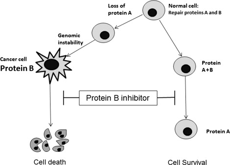

# Knitr
```{r, include=F}
knitr::opts_chunk$set(
  warning=F,
  message=F,
  echo=F,
  error=F,
  number_section=T,
  include=F
)
```

# Libraries
```{r, include=F}
# Load Libraries
library(vroom)
library(tidyverse)
library(ggplot2)
library(kableExtra)
library(here)
library(jsonlite)
library(reticulate)
use_python("/home/balter/conda/bin/python")
use_condaenv("base")
```

_A synthetic lethal interaction between two paired genes indicates that perturbation of either gene alone is viable, but that perturbation of both genes simultaneously causes the loss of viability_

# Inhibition of DNA Repair as a Therapeutic Target

Stephany Veuger, Nicola J. Curtin, in Cancer Drug Design and Discovery (Second Edition), 2014
Concept of Synthetic Lethality

The term “synthetic lethality” was originally coined by geneticists in the 1940s to describe the process where mutations in two different genes together resulted in cell death but independently did not affect viability [280]. The concept was applied to cancer somewhat later to explain the selective killing of cancer cells with particular molecular defects, by some agents [281]. It is becoming apparent that dysregulation of the DNA damage response (DDR), that contributes to the genomic instability that is an enabling characteristic of cancer, can be exploited by the synthetic lethality approach. Loss of one component of the DDR may be compensated by another backup component in the same (or different) pathway, on which the cancer cell becomes dependent. This has been termed “non-oncogene addiction”. Inactivating this compensatory pathway is therefore a means of selectively targeting the tumor (Fig. 8.12). Exploitation of dysregulation of the DDR by the synthetic lethality approach is perhaps the most exciting prospect for the future of cancer treatment [282].
Sign in to download full-size image

FIGURE 8.12. Synthetic lethality: normal cells contain primary and backup DDR proteins (A and B) to cope with endogenous and induced DNA damage. The genomic instability that enables cancer to develop can be due to loss of one of these pathways (A) leading to hyperdependence on the other (B), which may be amplified. Using an inhibitor of B leads to cell death in the cancer cell but not the normal cell, because this still has protein A to deal with endogenous or induced DNA damage.

# SLORTH Database
http://slorth.biochem.sussex.ac.uk/





# A Data Integration Workflow to Identify Drug Combinations Targeting Synthetic Lethal Interactions | Protocol
https://www.jove.com/t/60328/a-data-integration-workflow-to-identify-drug-combinations-targeting

_A synthetic lethal interaction between two genes is given when knock-out of either one of the two genes does not affect cell viability but knock-out of both synthetic lethal interactors leads to loss of cell viability or cell death. The best studied synthetic lethal interaction is between BRCA1/2 and PARP1, with PARP1 inhibitors being used in clinical practice to treat patients with BRCA1/2 mutated tumors. Large genetic screens in model organisms but also in haploid human cell lines have led to the identification of numerous additional synthetic lethal interaction pairs, all being potential targets of interest in the development of novel tumor therapies. One approach is to therapeutically target genes with a synthetic lethal interactor that is mutated or significantly downregulated in the tumor of interest. A second approach is to formulate drug combinations addressing synthetic lethal interactions. In this article, we outline a data integration workflow to evaluate and identify drug combinations targeting synthetic lethal interactions. We make use of available datasets on synthetic lethal interaction pairs, homology mapping resources, drug-target links from dedicated databases, as well as information on drugs being investigated in clinical trials in the disease area of interest. We further highlight key findings of two recent studies of our group on drug combination assessment in the context of ovarian and breast cancer._


Integrative analysis of large-scale loss-of-function screens identifies robust cancer-associated genetic interactions | eLife
https://elifesciences.org/articles/58925

Integrative omics analysis reveals relationships of genes with synthetic lethal interactions through a pan-cancer analysis - ScienceDirect
https://www.sciencedirect.com/science/article/pii/S2001037020304372


The underlying mechanism for the PARP and BRCA synthetic lethality: Clearing up the misunderstandings - PMC
https://www.ncbi.nlm.nih.gov/pmc/articles/PMC5528309/

Advances in synthetic lethality for cancer therapy: cellular mechanism and clinical translation | Journal of Hematology & Oncology | Full Text
https://jhoonline.biomedcentral.com/articles/10.1186/s13045-020-00956-5

Definition of synthetic lethality - NCI Dictionary of Cancer Terms - NCI
https://www.cancer.gov/publications/dictionaries/cancer-terms/def/synthetic-lethality

What is a PARP inhibitor? Uses, how they work, and options
https://www.medicalnewstoday.com/articles/parp-inhibitor

PARP Inhibitors: The First Synthetic Lethal Targeted Therapy - PMC
https://www.ncbi.nlm.nih.gov/pmc/articles/PMC6175050/

New Cancer Therapy Hopes to Treat Multiple Types of Cancers
https://healthblog.uofmhealth.org/cancer-care/parp-inhibitors-deliver-double-dose-of-no-dna-repair-to-cancer-cells

BRCA1 gene: MedlinePlus Genetics
https://medlineplus.gov/genetics/gene/brca1/

Collateral Lethality: A New Therapeutic Strategy in Oncology: Trends in Cancer
https://www.cell.com/trends/cancer/fulltext/S2405-8033(15)00039-4

The Concept of Synthetic Lethality in the Context of Anticancer Therapy | Nature Reviews Cancer
https://www.nature.com/articles/nrc1691

Synthetic lethality and cancer | Nature Reviews Genetics
https://www.nature.com/articles/nrg.2017.47

Advances in synthetic lethality for cancer therapy: cellular mechanism and clinical translation | Journal of Hematology & Oncology | Full Text
https://jhoonline.biomedcentral.com/articles/10.1186/s13045-020-00956-5

Synthetic lethality: General principles, utility and detection using genetic screens in human cells - PMC
https://www.ncbi.nlm.nih.gov/pmc/articles/PMC3018572/

Behind the science magazine | GSK
https://www.gsk.com/en-gb/behind-the-science-magazine/

Synthetic lethality - Wikipedia
https://en.wikipedia.org/wiki/Synthetic_lethality

Synthetic Lethality in Cancer Therapeutics: The Next Generation | Cancer Discovery | American Association for Cancer Research
https://aacrjournals.org/cancerdiscovery/article/11/7/1626/666576/Synthetic-Lethality-in-Cancer-Therapeutics-The

SynLethDB: synthetic lethality database toward discovery of selective and sensitive anticancer drug targets - PMC
https://www.ncbi.nlm.nih.gov/pmc/articles/PMC4702809/

SynLethDB 2.0: a web-based knowledge graph database on synthetic lethality for novel anticancer drug discovery | Database | Oxford Academic
https://academic.oup.com/database/article/doi/10.1093/database/baac030/6585691

Computational methods, databases and tools for synthetic lethality prediction | Briefings in Bioinformatics | Oxford Academic
https://academic.oup.com/bib/article/23/3/bbac106/6555403

SynLethDB 2.0: A web-based knowledge graph database on synthetic lethality for novel anticancer drug discovery | bioRxiv
https://www.biorxiv.org/content/10.1101/2021.12.28.474346v1

The tumor therapy landscape of synthetic lethality | Nature Communications
https://www.nature.com/articles/s41467-021-21544-2

Syn-Lethality: An Integrative Knowledge Base of Synthetic Lethality towards Discovery of Selective Anticancer Therapies
https://www.hindawi.com/journals/bmri/2014/196034/

medsysbio.org/CGIdb/about/
http://www.medsysbio.org/CGIdb/about/

Frontiers | Pan-Cancer Analysis of Potential Synthetic Lethal Drug Targets Specific to Alterations in DNA Damage Response
https://www.frontiersin.org/articles/10.3389/fonc.2019.01136/full

Synthetic lethality across normal tissues is strongly associated with cancer risk, onset, and tumor suppressor specificity
https://www.science.org/doi/10.1126/sciadv.abc2100

Uncovering cancer vulnerabilities by machine learning prediction of synthetic lethality | Molecular Cancer | Full Text
https://molecular-cancer.biomedcentral.com/articles/10.1186/s12943-021-01405-8
