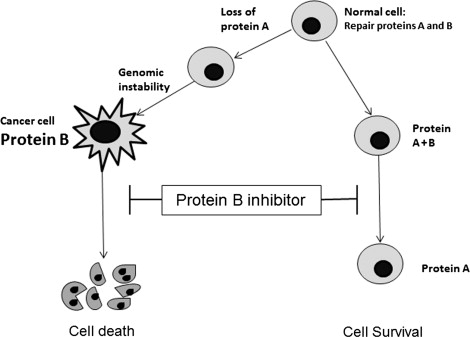

```{r, include=F}
knitr::opts_chunk$set(
  warning=F,
  message=F,
  echo=F,
  error=F,
  number_section=T
)
```


```{r, include=F}
# Load Libraries
```

# Working Definition

_A synthetic lethal interaction between two paired genes indicates that perturbation of either gene alone is viable, but that perturbation of both genes simultaneously causes the loss of viability_

# Definitions from Literature

## Inhibition of DNA Repair as a Therapeutic Target

Stephany Veuger, Nicola J. Curtin, in Cancer Drug Design and Discovery (Second Edition), 2014
https://www.sciencedirect.com/science/article/pii/B9780123965219000085?via%3Dihub


### Concept of Synthetic Lethality

>The term “synthetic lethality” was originally coined by geneticists in the 1940s to describe the process where mutations in two different genes together resulted in cell death but independently did not affect viability [280]. The concept was applied to cancer somewhat later to explain the selective killing of cancer cells with particular molecular defects, by some agents [281]. It is becoming apparent that dysregulation of the DNA damage response (DDR), that contributes to the genomic instability that is an enabling characteristic of cancer, can be exploited by the synthetic lethality approach. Loss of one component of the DDR may be compensated by another backup component in the same (or different) pathway, on which the cancer cell becomes dependent. This has been termed “non-oncogene addiction”. Inactivating this compensatory pathway is therefore a means of selectively targeting the tumor (Fig. 8.12). Exploitation of dysregulation of the DDR by the synthetic lethality approach is perhaps the most exciting prospect for the future of cancer treatment [282].

Sign in to download full-size image

### FIGURE 8.12. 
>Synthetic lethality: normal cells contain primary and backup DDR proteins (A and B) to cope with endogenous and induced DNA damage. The genomic instability that enables cancer to develop can be due to loss of one of these pathways (A) leading to hyperdependence on the other (B), which may be amplified. Using an inhibitor of B leads to cell death in the cancer cell but not the normal cell, because this still has protein A to deal with endogenous or induced DNA damage.





## A Data Integration Workflow to Identify Drug Combinations Targeting Synthetic Lethal Interactions
Protocol https://www.jove.com/t/60328/a-data-integration-workflow-to-identify-drug-combinations-targeting
Marhold, M., Heinzel, A., Merchant, A., Perco, P., Krainer, M. A Data Integration Workflow to Identify Drug Combinations Targeting Synthetic Lethal Interactions. <em>J. Vis. Exp.</em> (171), e60328, doi:10.3791/60328 (2021).

>A synthetic lethal interaction between two genes is given when knock-out of either one of the two genes does not affect cell viability but knock-out of both synthetic lethal interactors leads to loss of cell viability or cell death. The best studied synthetic lethal interaction is between BRCA1/2 and PARP1, with PARP1 inhibitors being used in clinical practice to treat patients with BRCA1/2 mutated tumors. Large genetic screens in model organisms but also in haploid human cell lines have led to the identification of numerous additional synthetic lethal interaction pairs, all being potential targets of interest in the development of novel tumor therapies. One approach is to therapeutically target genes with a synthetic lethal interactor that is mutated or significantly downregulated in the tumor of interest. A second approach is to formulate drug combinations addressing synthetic lethal interactions. In this article, we outline a data integration workflow to evaluate and identify drug combinations targeting synthetic lethal interactions. We make use of available datasets on synthetic lethal interaction pairs, homology mapping resources, drug-target links from dedicated databases, as well as information on drugs being investigated in clinical trials in the disease area of interest. We further highlight key findings of two recent studies of our group on drug combination assessment in the context of ovarian and breast cancer._


# Projects to Predict Synthetic Lethality

## SL-Cloud: A Cloud-based resource to support synthetic lethal interaction discovery 
Tercan B, Qin G, Kim TK et al. SL-Cloud: A Cloud-based resource to support synthetic lethal interaction discovery [version 1; peer review: awaiting peer review]. F1000Research 2022, 11:493 (https://doi.org/10.12688/f1000research.110903.1) 
https://f1000research.com/articles/11-493


Has list of data sources included. Software in the form of ipython notebooks. 

The _Use Cases_ section shows recapitulation of previously reported SL pairs.


## Pan-Cancer Analysis of Potential Synthetic Lethal Drug Targets Specific to Alterations in DNA Damage Response
https://www.frontiersin.org/articles/10.3389/fonc.2019.01136/full

[Supplementary table 1.](https://ndownloader.figstatic.com/files/18109007) gives list of previously reported SL pairs taken from the Literature.


## Uncovering cancer vulnerabilities by machine learning prediction of synthetic lethality
https://molecular-cancer.biomedcentral.com/articles/10.1186/s12943-021-01405-8

They say things like "identified" or even "validated" previously unreported SL interactions. But I don't think they mean that they went and tested them in the lab.


## Predicting synthetic lethal interactions using conserved patterns in protein interaction networks
Benstead-Hume G, Chen X, Hopkins SR, Lane KA, Downs JA, Pearl FMG. Predicting synthetic lethal interactions using conserved patterns in protein interaction networks. PLoS Comput Biol. 2019 Apr 17;15(4):e1006888. doi: 10.1371/journal.pcbi.1006888. PMID: 30995217; PMCID: PMC6488098.
https://journals.plos.org/ploscompbiol/article?id=10.1371/journal.pcbi.1006888

Another with PPI


# Other Database and Knowledge Graph Projects

## SLORTH Database
http://slorth.biochem.sussex.ac.uk/

Benstead-Hume G, Chen X, Hopkins SR, Lane KA, Downs JA, Pearl FMG. Predicting synthetic lethal interactions using conserved patterns in protein interaction networks. PLoS Comput Biol. 2019 Apr 17;15(4):e1006888. doi: 10.1371/journal.pcbi.1006888. PMID: 30995217; PMCID: PMC6488098.
https://www.ncbi.nlm.nih.gov/pmc/articles/PMC6488098/

Using protein-protein interactions.


## SynLethDB 2.0: a web-based knowledge graph database on synthetic lethality for novel anticancer drug discovery | Database | Oxford Academic
https://academic.oup.com/database/article/doi/10.1093/database/baac030/6585691

An extensive knowledge graph compiled from other sources. Some of these contain known SL pairs. Others are used for prediction. SynLethDB 2.0 ingested hetionet using scripts provided by hetionet. Does prediction using some simple statistical models.

Published in May 2022, provides a portal presumably to facilitate that group and other groups to use this resource to generate results to be published or used for R&D.

Perhaps worthwhile looking at the _Case Studies_ in the [results section](https://academic.oup.com/database/article/doi/10.1093/database/baac030/6585691#354329910).


# Review of Papers, Projects, Databases, Methods

## Computational methods, databases and tools for synthetic lethality prediction
Jing Wang, Qinglong Zhang, Junshan Han, Yanpeng Zhao, Caiyun Zhao, Bowei Yan, Chong Dai, Lianlian Wu, Yuqi Wen, Yixin Zhang, Dongjin Leng, Zhongming Wang, Xiaoxi Yang, Song He, Xiaochen Bo, Computational methods, databases and tools for synthetic lethality prediction, Briefings in Bioinformatics, Volume 23, Issue 3, May 2022, bbac106, https://doi.org/10.1093/bib/bbac106
https://academic.oup.com/bib/article/23/3/bbac106/6555403

[Table 1](https://academic.oup.com/view-large/355042715) lists some recent clinical trials related to SL (https://clinicaltrials.gov/ct2/home). All of the listed agents are inhibitors

[Table 2](https://academic.oup.com/view-large/355042721) lists other projects/databases reviewed in the paper.

[Table 5](https://academic.oup.com/view-large/355042762) Summary of SL prediction methods and representative models

[Table 6](https://academic.oup.com/view-large/355042763) Summary of studies involved in this review

[Table 7](https://academic.oup.com/view-large/355042764) Performance scores and validation scheme of the methods involved in this review

A [supplementary file](https://oup.silverchair-cdn.com/oup/backfile/Content_public/Journal/bib/23/3/10.1093_bib_bbac106/1/supplementary_file_bbac106.docx?Expires=1661576681&Signature=1QnjbBLzIR~ypfnlCHzEydFBy7iUJLpu52Rraj6a1r8zjSYg8q5wnUkLR9S2g2~iFbbjWXTYAik-tPltzEo~PKla784lOJqoLWy5LP7vJdBOitJBKF8RXvpIGU3LksejuHEySWcxlTHcLIsNz3dCM9fkzTsuQf3vQ7UDpKyxo6WLm6Fg87h-pLb~xHuzy7c2uewzpSkCcLllD0aot5NyQNCCRTbh7j6wrr-e6NmyxEISvvHO5kxwZE9qHWzLx-MdUABGr4SbdN7H0HDvG3QlDUh9Mxjj92l5W-je3c4PyZ6441yowZgP2KVdz5mduG3qsaFaUZyBT2GW4COk84EY4A__&Key-Pair-Id=APKAIE5G5CRDK6RD3PGA) has text describing some of the datasets commonly used. 


# Possibly Interesting
## Synthetic lethality across normal tissues is strongly associated with cancer risk, onset, and tumor suppressor specificity
https://www.science.org/doi/10.1126/sciadv.abc2100


## Comprehensive prediction of robust synthetic lethality between paralog pairs in cancer cell lines
Barbara De Kegel, Niall Quinn, Nicola A. Thompson, David J. Adams, Colm J. Ryan,
Comprehensive prediction of robust synthetic lethality between paralog pairs in cancer cell lines,Cell Systems,Volume 12, Issue 12, 2021, Pages 1144-1159.e6, ISSN 2405-4712, https://doi.org/10.1016/j.cels.2021.08.006.
https://www.sciencedirect.com/science/article/pii/S240547122100329X


## Pan-Cancer Analysis of Potential Synthetic Lethal Drug Targets Specific to Alterations in DNA Damage Response
Das Shaoli, Camphausen Kevin, Shankavaram Uma, Frontiers in Oncology, 9l 2019
https://www.frontiersin.org/articles/10.3389/fonc.2019.01136/full
https://www.frontiersin.org/articles/10.3389/fonc.2019.01136 


```{css, echo=F}
body {
  font-size: 16pt;
}

p {
  font-size: 1em;
}

h1.title {
  font-size: 3em;
}

h1 {
  font-size: 2.2em;
}

h2 {
  font-size: 1.8em
}

h3 {
  font-size: 1.4em
}
```


<!-- SynLethDB 2.0: A web-based knowledge graph database on synthetic lethality for novel anticancer drug discovery | bioRxiv -->
<!-- https://www.biorxiv.org/content/10.1101/2021.12.28.474346v1 -->

<!-- The tumor therapy landscape of synthetic lethality | Nature Communications -->
<!-- https://www.nature.com/articles/s41467-021-21544-2 -->

<!-- Syn-Lethality: An Integrative Knowledge Base of Synthetic Lethality towards Discovery of Selective Anticancer Therapies -->
<!-- https://www.hindawi.com/journals/bmri/2014/196034/ -->

<!-- medsysbio.org/CGIdb/about/ -->
<!-- http://www.medsysbio.org/CGIdb/about/ -->

<!-- Frontiers | Pan-Cancer Analysis of Potential Synthetic Lethal Drug Targets Specific to Alterations in DNA Damage Response -->
<!-- https://www.frontiersin.org/articles/10.3389/fonc.2019.01136/full -->

<!-- Synthetic lethality across normal tissues is strongly associated with cancer risk, onset, and tumor suppressor specificity -->
<!-- https://www.science.org/doi/10.1126/sciadv.abc2100 -->

<!-- Uncovering cancer vulnerabilities by machine learning prediction of synthetic lethality | Molecular Cancer | Full Text -->
<!-- https://molecular-cancer.biomedcentral.com/articles/10.1186/s12943-021-01405-8 -->
<!-- The underlying mechanism for the PARP and BRCA synthetic lethality: Clearing up the misunderstandings - PMC -->
<!-- https://www.ncbi.nlm.nih.gov/pmc/articles/PMC5528309/ -->

<!-- Advances in synthetic lethality for cancer therapy: cellular mechanism and clinical translation | Journal of Hematology & Oncology | Full Text -->
<!-- https://jhoonline.biomedcentral.com/articles/10.1186/s13045-020-00956-5 -->

<!-- Definition of synthetic lethality - NCI Dictionary of Cancer Terms - NCI -->
<!-- https://www.cancer.gov/publications/dictionaries/cancer-terms/def/synthetic-lethality -->

<!-- What is a PARP inhibitor? Uses, how they work, and options -->
<!-- https://www.medicalnewstoday.com/articles/parp-inhibitor -->

<!-- PARP Inhibitors: The First Synthetic Lethal Targeted Therapy - PMC -->
<!-- https://www.ncbi.nlm.nih.gov/pmc/articles/PMC6175050/ -->

<!-- New Cancer Therapy Hopes to Treat Multiple Types of Cancers -->
<!-- https://healthblog.uofmhealth.org/cancer-care/parp-inhibitors-deliver-double-dose-of-no-dna-repair-to-cancer-cells -->

<!-- BRCA1 gene: MedlinePlus Genetics -->
<!-- https://medlineplus.gov/genetics/gene/brca1/ -->

<!-- Collateral Lethality: A New Therapeutic Strategy in Oncology: Trends in Cancer -->
<!-- https://www.cell.com/trends/cancer/fulltext/S2405-8033(15)00039-4 -->

<!-- The Concept of Synthetic Lethality in the Context of Anticancer Therapy | Nature Reviews Cancer -->
<!-- https://www.nature.com/articles/nrc1691 -->

<!-- Synthetic lethality and cancer | Nature Reviews Genetics -->
<!-- https://www.nature.com/articles/nrg.2017.47 -->

<!-- Advances in synthetic lethality for cancer therapy: cellular mechanism and clinical translation | Journal of Hematology & Oncology | Full Text -->
<!-- https://jhoonline.biomedcentral.com/articles/10.1186/s13045-020-00956-5 -->

<!-- Synthetic lethality: General principles, utility and detection using genetic screens in human cells - PMC -->
<!-- https://www.ncbi.nlm.nih.gov/pmc/articles/PMC3018572/ -->

<!-- Behind the science magazine | GSK -->
<!-- https://www.gsk.com/en-gb/behind-the-science-magazine/ -->

<!-- Synthetic lethality - Wikipedia -->
<!-- https://en.wikipedia.org/wiki/Synthetic_lethality -->

<!-- Synthetic Lethality in Cancer Therapeutics: The Next Generation | Cancer Discovery | American Association for Cancer Research -->
<!-- https://aacrjournals.org/cancerdiscovery/article/11/7/1626/666576/Synthetic-Lethality-in-Cancer-Therapeutics-The -->

<!-- SynLethDB: synthetic lethality database toward discovery of selective and sensitive anticancer drug targets - PMC -->
<!-- https://www.ncbi.nlm.nih.gov/pmc/articles/PMC4702809/ -->


<!-- DNA repair pathway  -->
<!-- https://www.frontiersin.org/articles/10.3389/fphar.2020.629266/full -->


Given a known cancer drug that treats one cell type, can we predict other cell types sensitive to that drug?
Given a cell type treated by a list of drugs, are there other known drugs that could treat that cell type?
